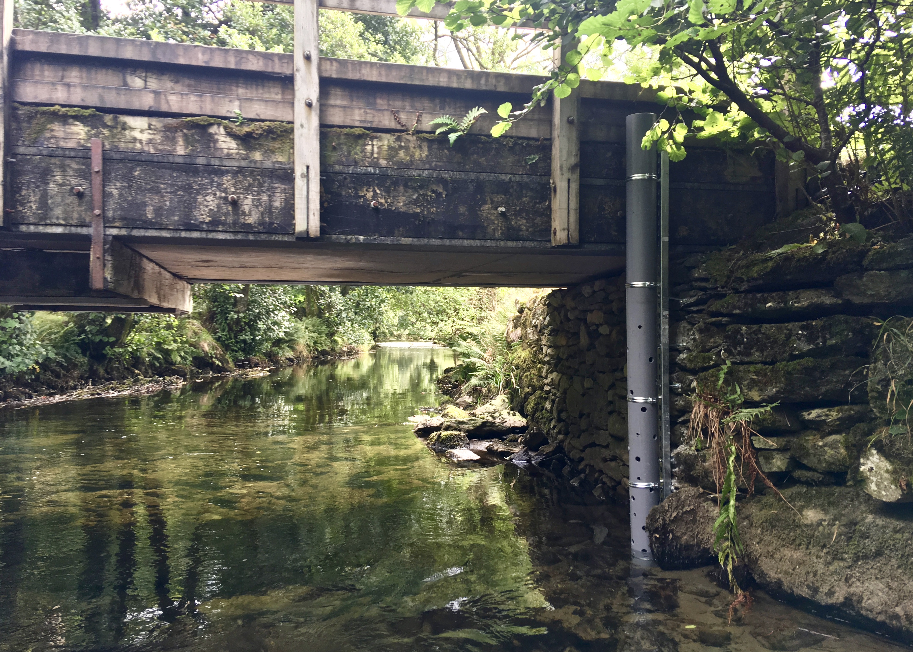
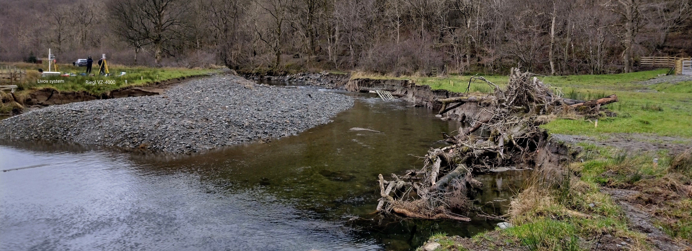

 
  

<h1 align="center"> Hydraulic effects of channel reconfiguration and floodplain reconnection </h1>
 

<!-- TABLE OF CONTENTS -->
<h2 id="table-of-contents"> :book: Table of Contents</h2>

  
Table of Contents

  <ol>
    <li><a href="#about-the-project"> ➤ About The Project</a></li>
    <li><a href="#prerequisites"> ➤ Prerequisites</a></li>
    <li><a href="#Repository Structure"> ➤ Repository Structure</a></li>
    <li><a href="#How to use"> ➤ How to use</a></li>

<!-- ABOUT THE PROJECT -->
<h2 id="about-the-project"> :pencil: About The Project</h2>

 
This project seeks to develop the evidence base for how channel reconfiguration and floodplain reconnection can affect the hydraulic behavior in the affected reach. This repository provides data and code used to generate figures present within the research article "Hydraulic effects of channel reconfiguration and floodplain reconnection". 

<!-- PREREQUISITES -->
<h2 id="prerequisites"> :fork_and_knife: Prerequisites</h2>

**Replicating the outputs** presented in "Hydraulic effects of channel reconfiguration and floodplain reconnection" requires the user to download the data files and code from this GitHub repository, and to be able to run MATLAB 2019a onwards. The easiest way of achieving this is to clone the repository onto you PC. 

<!-- Repository Structure -->
<h2 id="Repository Structure"> :cactus: Repository Structure</h2>

 
  
Below is the an outline of the folder structure within this repository with descriptions provided:

    .
    ├── code                        
    │   ├── dependencies            # dependencies for running figures scipts
    │   ├── figures                 # folder containing scripts to reproduce figures
    ├── data                        # folder containing underlying data 
    ├── images                      # folder containing images used in repository 
 
  

  
<!-- How to use -->
<h2 id="How to use"> 👍 How to use</h2>

 
    
* Clone or download this repository so that it is accessible on your PC.
* Open MATLAB on your PC.
* Ensure that the folder containing the downloaded repsoitory is visible on the MATLAB path.
* Open the .m file of the Figure that you would like to reproduce.
* Read the preamble and define any variables (links to folders) as requried.
* Run the script.
    
  

  
 
  
  

  
 
  Photo taken at the upper section of the reconfigured reach of Goldrill Beck.
  

  
